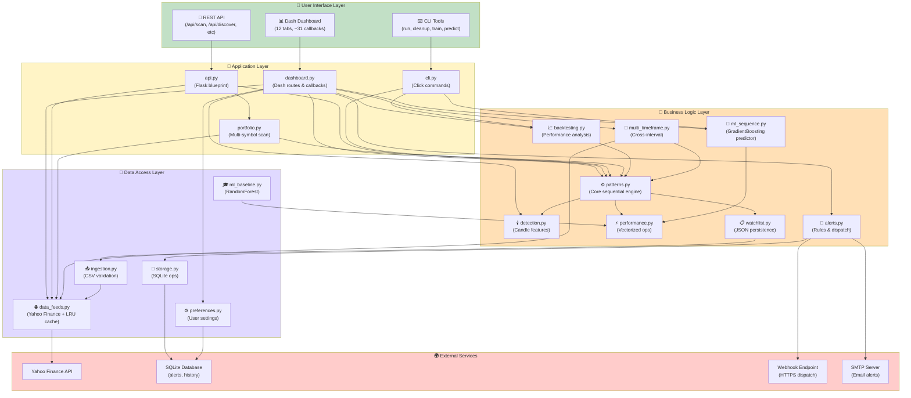
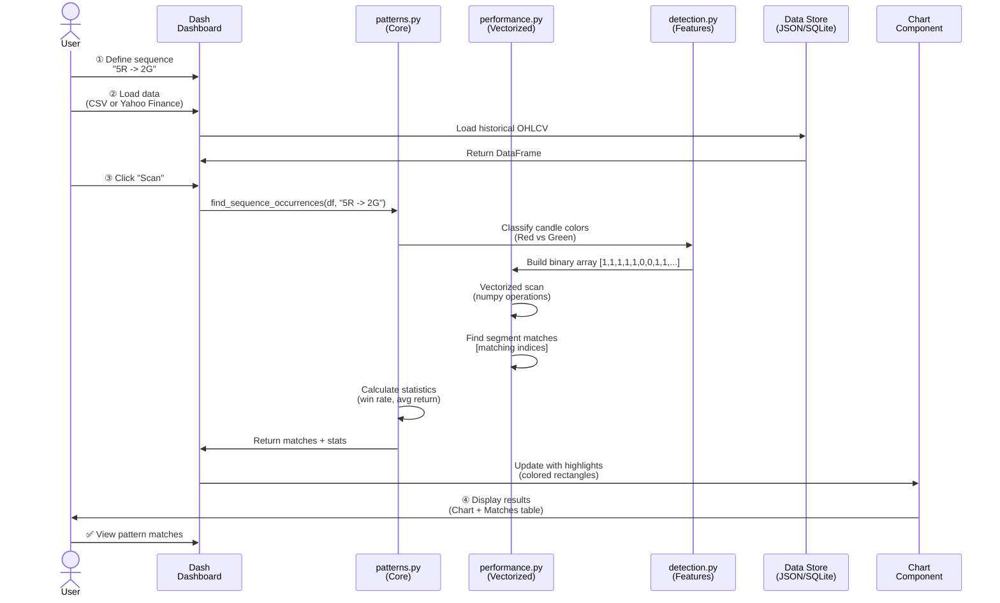
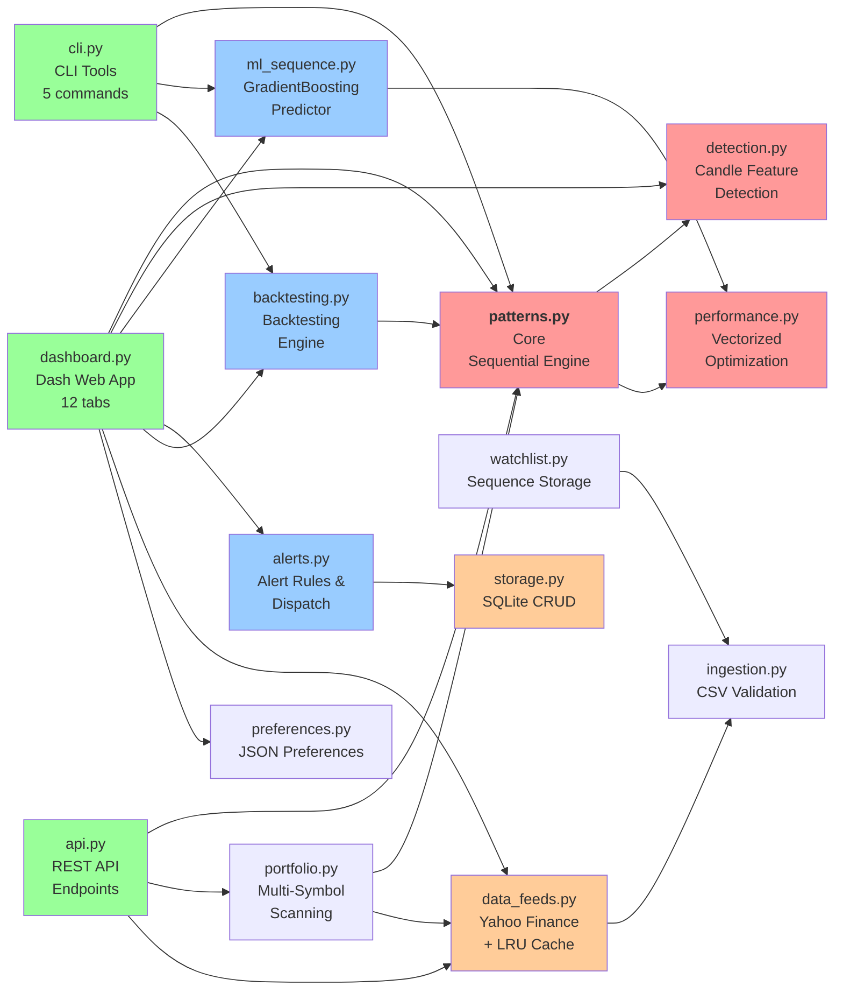
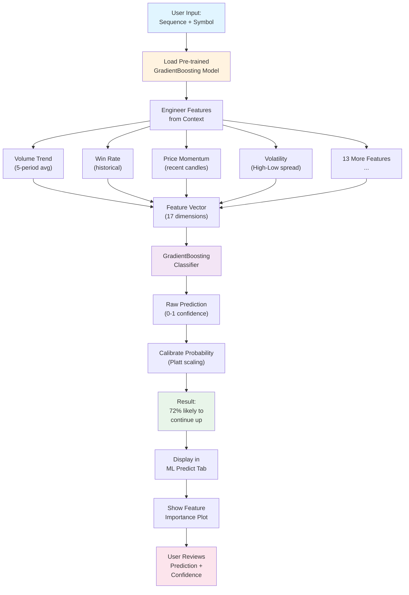
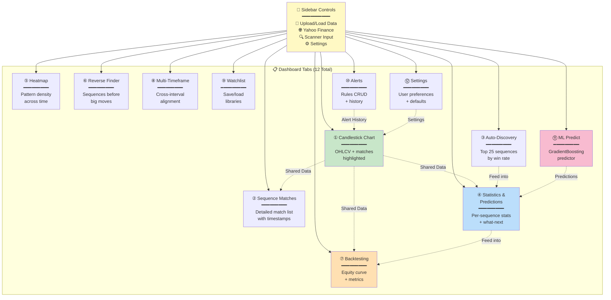

# Architecture Diagrams — Candlestick Patterns

**Purpose:** Visual representations of system components, data flows, and interactions.  
**Format:** Mermaid diagram syntax  
**Last Updated:** April 3, 2026

---

## 1. Component Architecture Diagram

Hierarchical view of system layers and their dependencies.



---

## 2. Data Flow Diagram — Sequence Scanning (Primary User Flow)

Step-by-step flow from user input to results display.



---

## 3. Module Dependency Graph

Core module relationships and import paths.



---

## 4. Alert Dispatch Flow (Background Process)

How alerts are triggered and delivered to users.

```mermaid
stateDiagram-v2
    [*] --> CheckRules: Every 5 seconds<br/>check_and_trigger()
    
    CheckRules --> QueryDB: Query SQLite<br/>alert_rules table
    QueryDB --> RuleActive{Alert rule<br/>enabled?}
    
    RuleActive -->|No| CheckRules
    RuleActive -->|Yes| CheckSequence{Sequence<br/>occurred?}
    
    CheckSequence -->|No| CheckRules
    CheckSequence -->|Yes| LogHistory: Log to<br/>alert_history
    
    LogHistory --> SendWebhook{Webhook<br/>configured?}
    SendWebhook -->|Yes| WebhookDispatch: Dispatch HTTPS<br/>POST request
    WebhookDispatch --> WebhookResult{Success?}
    WebhookResult -->|Yes| SendEmail
    WebhookResult -->|No| LogError: Log error
    
    SendEmail{Email<br/>configured?}
    SendEmail -->|Yes| EmailDispatch: Send via SMTP<br/>TLS
    EmailDispatch --> NotifyDash: Update dashboard<br/>Alerts tab
    SendEmail -->|No| NotifyDash
    
    LogError --> CheckRules
    NotifyDash --> [*]: Alert<br/>delivered
```

---

## 5. ML Prediction Pipeline (Advanced Analytics)

Process from user input to ML inference.



---

## 6. Dashboard Tab Topology

All 12 tabs and their relationships.



---

## 7. Deployment Architecture (Docker)

Multi-stage build and containerization.

```mermaid
graph LR
    DEV["Developer<br/>Local Machine"]
    
    BUILD1["Stage 1:<br/>Builder<br/>━━━━━━<br/>python:3.12<br/>+ build tools"]
    BUILD1_WORK["Setup venv<br/>Install deps<br/>Run tests<br/>Build wheel"]
    
    BUILD2["Stage 2:<br/>Runtime<br/>━━━━━━<br/>python:3.12-slim<br/>+ runtime"]
    BUILD2_WORK["Copy wheels<br/>from stage 1<br/>Install deps<br/>Configure app"]
    
    REGISTRY["Docker Registry<br/>docker.io"]
    
    PROD["Production<br/>Deploy to<br/>━━━━━━<br/>Cloud (AWS/GCP)<br/>or On-Premise"]
    
    DEV -->|git push| GITHUB["GitHub Repo<br/>━━━━━━<br/>feature/mvp-setup<br/>branch"]
    
    GITHUB -->|Webhook| CI["CI/CD Pipeline<br/>GitHub Actions<br/>━━━━━━<br/>Test (pytest)<br/>Lint (ruff)<br/>Build (Dockerfile)"]
    
    CI --> BUILD1
    BUILD1 --> BUILD1_WORK
    BUILD1_WORK --> BUILD2
    BUILD2 --> BUILD2_WORK
    
    BUILD2_WORK --> REGISTRY
    REGISTRY --> PROD
    
    PROD --> RUN["Running Container<br/>━━━━━━<br/>Port 8050<br/>(Dash)<br/>Port 5000<br/>(Flask API)"]
    
    RUN --> USER["End User<br/>━━━━━━<br/>Browser<br/>localhost:8050"]
    
    style BUILD1 fill:#e3f2fd
    style BUILD1_WORK fill:#bbdefb
    style BUILD2 fill:#e3f2fd
    style BUILD2_WORK fill:#bbdefb
    style CI fill:#fff3e0
    style PROD fill:#e8f5e9
    style RUN fill:#f3e5f5
```



---

## 8. Authentication & Authorization (Future)

Path to multi-user system with role-based access.

```mermaid
graph TD
    LOGIN["User Login<br/>━━━━━━━━━━<br/>Username/Password"]
    
    LOGIN --> AUTH["Authentication<br/>━━━━━━━━━━<br/>Query users table<br/>Verify password_hash<br/>Create session"]
    
    AUTH --> ROLES{Check Role}
    
    ROLES -->|viewer| PERMS_V["Permissions:<br/>✓ View dashboard<br/>✓ View reports<br/>✗ Create alerts<br/>✗ Admin panel"]
    
    ROLES -->|trader| PERMS_T["Permissions:<br/>✓ View dashboard<br/>✓ Create alerts<br/>✓ Run backtest<br/>✗ Admin panel"]
    
    ROLES -->|admin| PERMS_A["Permissions:<br/>✓ Full system access<br/>✓ User management<br/>✓ Settings<br/>✓ Audit logs"]
    
    PERMS_V --> ENFORCE["Enforce<br/>━━━━━━━━━━<br/>@require_role<br/>decorator"]
    PERMS_T --> ENFORCE
    PERMS_A --> ENFORCE
    
    ENFORCE --> ACCESS{User Action}
    
    ACCESS -->|Allowed| GRANT["✅ Grant Access<br/>Execute request"]
    ACCESS -->|Denied| DENY["❌ Deny Access<br/>403 Forbidden"]
    
    GRANT --> LOG["Log to<br/>audit_log table"]
    DENY --> LOG
    
    LOG --> [*]
    
    style LOGIN fill:#c8e6c9
    style AUTH fill:#bbdefb
    style PERMS_V fill:#ffe0b2
    style PERMS_T fill:#ffe0b2
    style PERMS_A fill:#ffccbc
    style GRANT fill:#c8e6c9
    style DENY fill:#ffcdd2
```

---

## Usage Notes

These diagrams complement the textual [architecture.md](architecture.md) documentation:

- **Component Diagram** — Understand which modules talk to which
- **Data Flow (Sequence)** — Follow a typical user interaction step-by-step
- **Dependency Graph** — Identify circular dependencies or tightly coupled modules
- **Alert Flow** — Understand how background alerts work
- **ML Pipeline** — See the steps from input to prediction
- **Dashboard Tabs** — Know what each tab does and how they relate
- **Deployment** — Understand Docker build and production deployment
- **Auth (Future)** — Plan for multi-user/RBAC rollout in Phase 13

For implementation details, see [architecture.md](architecture.md) and [MPDP.md](MPDP.md).
